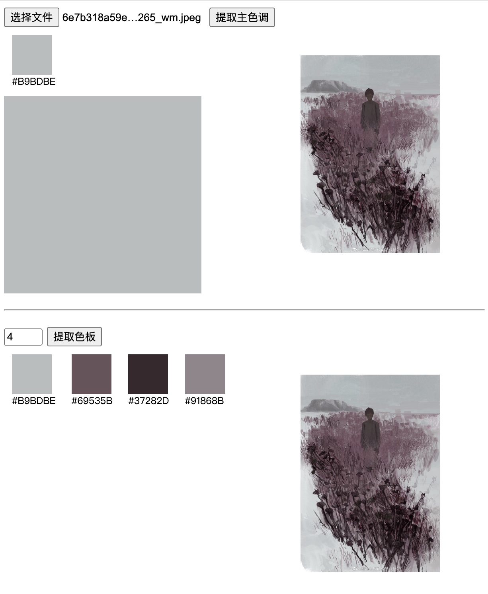

# dominant_color_demo

使用 Go 编写的 wasm 模块，实现获取 JS 环境选择的图片的主色调功能；主色调的查询使用 k-means 算法在 Go 环境计算。



## start

```bash
./start.sh
```

这个命令会自动执行下面的 `build` 和 `run demo` 步骤

## build

```bash
./build.sh
# or
GOOS=js GOARCH=wasm go build -o ./build/dominant_color.wasm ./dominant_color
```

## run demo

```bash
./server.sh
# or
cp "$(go env GOROOT)/misc/wasm/wasm_exec.js" ./build
go run ./web_server
```

启动服务后，访问：http://localhost:8082 （需要支持 WebAssembly、async、await 的现代浏览器）
