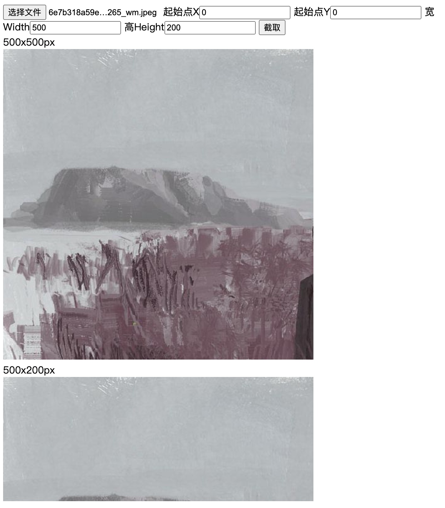

# dominant_color_demo

## 功能 1

使用 Go 编写 wasm 模块，实现获取 JS 环境选择的图片的主色调功能；使用 k-means 算法在 Go 环境运行计算得到主色调值；k-means 算法支持获取图片多个主色调值，因此可以扩充为获取图片色卡功能。


## 功能 2

使用 Go 编写 wasm 模块，实现 JS 环境选择图片并输入裁剪参数进行裁剪；裁剪图片的部分数据是在 Go 环境实现。



## start

```bash
./start.sh
```

这个命令会自动执行下面的 `build` 和 `run demo` 步骤

## build

```bash
./build.sh
# or
GOOS=js GOARCH=wasm go build -o ./build/dominant_color.wasm ./dominant_color
```

## run demo

```bash
./server.sh
# or
cp "$(go env GOROOT)/misc/wasm/wasm_exec.js" ./build
go run ./web_server
```

启动服务后，访问：http://localhost:8082 （需要支持 `WebAssembly`、`async`、`await` 的现代浏览器）

- 计算图片主色调：http://localhost:8082/index.html
- 对图片进行截取：http://localhost:8082/crop.html
