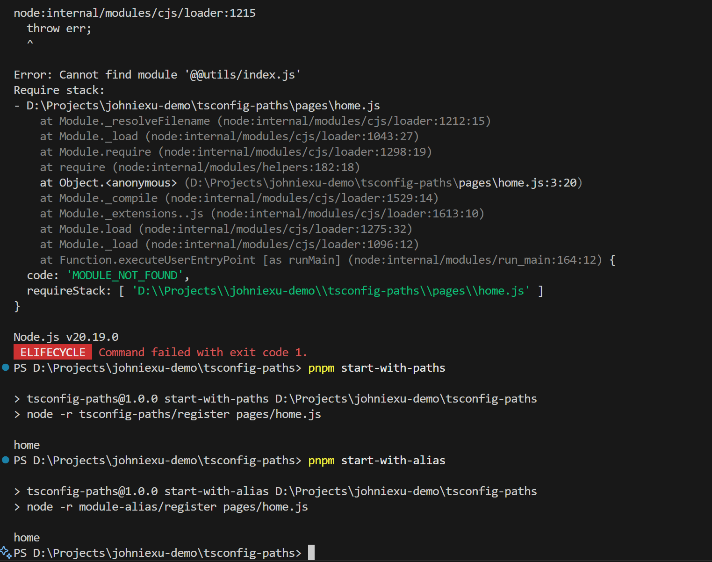

## run

- build project

```bash
pnpm build
```

- run project without an alias config

```bash
pnpm start
```

- run project with tsconfig-paths config

```bash
pnpm start-with-paths
```

- run project with module-alias config

```bash
pnpm start-with-alias
```

- result



## issue

https://github.com/jonaskello/tsconfig-paths/issues/276


## referrences

- https://stackoverflow.com/questions/76765069/node-js-typescript-how-to-setup-path-alias
- https://stackoverflow.com/questions/58809944/cannot-find-module-typescript-path-alias-error
- https://www.typescriptlang.org/tsconfig/#paths
- https://www.npmjs.com/package/tsconfig-paths
- https://github.com/ilearnio/module-alias/issues/113
- https://nodejs.org/api/packages.html#packages_imports
- https://github.com/nestjs/nest-cli/issues/2858 (not support esm)
- https://github.com/justkey007/tsc-alias (another solution)